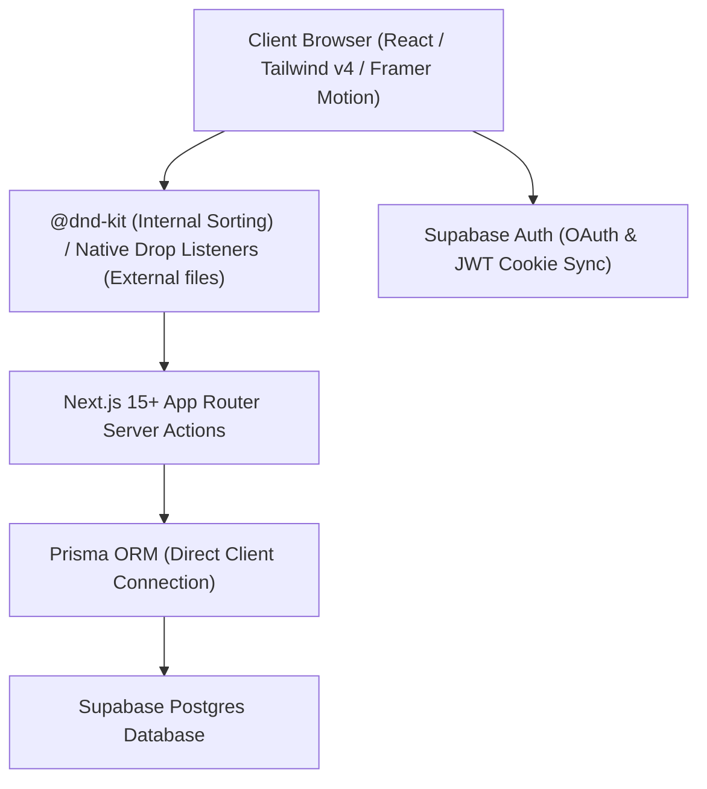

# Design Specification: Essential Space Antigravity 2.0

**Project Name:** Essential Space Antigravity 2.0  
**Aesthetic Theme:** Neo-Brutalist Swiss Gallery (Direction 1)  
**Creation Date:** June 20, 2026  
**Status:** Approved  

---

## 1. Executive Summary & Design System

Essential Space Antigravity 2.0 is a premium digital canvas for capturing, archiving, and categorizing drag-and-drop assets. Moving away from typical dark-mode SaaS or warm terracotta templates, this product leverages a neo-brutalist Swiss gallery aesthetic: structural layouts, hard borders, raw grids, and asymmetric weights that echo architectural prints.

### 🎨 Color Palette & Typography

| Layer / Role | Description | Value |
| :--- | :--- | :--- |
| **Canvas Background** | Slate White | `#F9F9FB` |
| **Borders & Primary Text**| Deep Ink Black | `#0B0C10` |
| **Muted Panels / Slots** | Studio Grey | `#EAEAEA` |
| **Accent / Focus / Hover** | Safety Orange | `#FF5A36` |

*   **Display Font:** *Syne* (for wide, grotesque, and impactful headers).
*   **Body Font:** *DM Sans* (for clean, highly legible copy text).
*   **Utility/Metadata Font:** *JetBrains Mono* (for technical numbers, card tags, resolution, and sizes).

---

## 2. Technical Stack Architecture

The codebase is built on modern React and Postgres foundations:



*   **Frontend Framework:** Next.js 15+ App Router (TypeScript).
*   **Styling Engine:** Tailwind CSS v4.
*   **Animation Library:** Framer Motion (for smooth structural transitions).
*   **Drag & Drop Engine:** `@dnd-kit/core` & `@dnd-kit/sortable` (for grid sorting and sidebar updates).
*   **Auth Provider:** Supabase Auth (OAuth / Passwordless Email).
*   **Database & ORM:** Supabase Postgres via Prisma ORM.

---

## 3. Asymmetric Grid & UI Layout

The layout is split into two asymmetrical panels at a `30 / 70` ratio:

```
+------------------------------------------------------------------------------------+
|  [ES] ESSENTIAL SPACE (Grotesque Wide)             👤 panav@domain.com  [Logout]   |
+-----------------------------------+------------------------------------------------+
|                                   |                                                |
|  * 01. ACTIVE CATEGORIES          |  * 02. PRIMARY CANVAS                          |
|                                   |                                                |
|  [01] INBOX (12 items)            |  +------------------+  +--------------------+  |
|  [02] INSPIRATION (5 items)       |  | IMAGE CARD       |  | TEXT CARD          |  |
|  [03] READ LATER (3 items)        |  | [Photo Preview]  |  | "Refactor the UI   |  |
|  [04] QUICK SNIPPETS (8 items)    |  |                  |  | with Tailwind v4   |  |
|                                   |  | 1920x1080 (3MB)  |  | guidelines..."     |  |
|  +-----------------------------+  |  +------------------+  +--------------------+  |
|  | + NEW CATEGORY              |  |                                                |
|  +-----------------------------+  |  +------------------+  +--------------------+  |
|                                   |  | LINK CARD        |  | SCREENSHOT         |  |
|  * 03. UPLOAD STATUS              |  | google.com/design|  | [Screen Preview]   |  |
|  [||||||||||.......] 60%          |  | 🏷️ Read Later    |  | 🏷️ Inbox           |  |
|  "drop_captured.png" (2.4MB)      |  +------------------+  +--------------------+  |
|                                   |                                                |
+-----------------------------------+------------------------------------------------+
```

### 3.1 Control Panel (Left 30% Width)
*   A fixed, non-scrolling side column containing brand identifiers.
*   Uses bold technical numbering structures (`01`, `02`, `03`) to frame sidebar headers.
*   Houses the Category List. Reordering the list vertically triggers a `@dnd-kit/sortable` event.
*   Includes a native drop listener overlay: dropping desktop files over a specific category folder automatically uploads it to that category.

### 3.2 Main Canvas (Right 70% Width)
*   A scrollable responsive grid displaying bookmark cards.
*   Enforces a strict grid layout utilizing Tailwind CSS Grid columns.
*   Rearranging items uses `@dnd-kit` with pointer sensors and `closestCorners` collision detection.

---

## 4. Polymorphic Card System

Cards dynamically morph depending on their database payload type:

1.  **LINK:**
    *   Renders the target bookmark's page header (fetched via Server Action or API scraper).
    *   Displays favicon imagery and a physical anchor link icon indicator.
2.  **TEXT / MARKDOWN:**
    *   Renders written snippets or notes.
    *   Styled with `JetBrains Mono` for monospace formatting (code blocks or list notes).
3.  **IMAGE / FILE:**
    *   Displays a clean frame border wrapping the image preview.
    *   Outputs structural file dimensions (resolution, byte size) using a monospace overlay.

---

## 5. Dual-Layer Drag-and-Drop Lifecycle

### 5.1 Internal Reordering (@dnd-kit)
*   **Pointer Sensor Activation:** Dragging only begins after moving the cursor 8px. This preserves natural clicks on links and text copying inside card elements.
*   **Collision Detection:** Utilizes `closestCorners` to avoid collision jitters across multi-column grids.
*   **Transitions:** Framer Motion handles dynamic card positions as placeholders swap.

### 5.2 External File Drops (Native HTML5 API)
*   **Trigger:** Dragging any file from a desktop computer over the browser window triggers a fullscreen grid overlay with a thick Safety Orange (`#FF5A36`) border.
*   **Drop Handler:** Intercepts the `FileList` payload, begins file upload, and parses meta information before sending to Prisma.
*   **Sidebar Drop:** Dropping a file directly onto a sidebar category slot categorizes the item immediately.

---

## 6. Database Schema (Prisma)

```prisma
datasource db {
  provider  = "postgresql"
  url       = env("DATABASE_URL")
  directUrl = env("DIRECT_URL")
}

generator client {
  provider = "prisma-client-js"
}

model UserProfile {
  id            String     @id @default(uuid())
  email         String     @unique
  selectedTheme String     @default("light-gold")
  createdAt     DateTime   @default(now())
  updatedAt     DateTime   @updatedAt
  categories    Category[]
  cards         Card[]
}

model Category {
  id        String   @id @default(uuid())
  name      String
  order     Int      
  userId    String
  user      UserProfile @relation(fields: [userId], references: [id], onDelete: Cascade)
  cards     Card[]
  createdAt DateTime @default(now())
  updatedAt DateTime @updatedAt

  @@unique([userId, name])
}

model Card {
  id          String      @id @default(uuid())
  type        String      // "LINK", "TEXT", "IMAGE", "FILE"
  title       String?     
  content     String      
  metadata    Json?       // Stores image width/height, bytes, favicon, domain
  order       Int         
  categoryId  String?
  category    Category?   @relation(fields: [categoryId], references: [id], onDelete: SetNull)
  userId      String
  user        UserProfile @relation(fields: [userId], references: [id], onDelete: Cascade)
  createdAt   DateTime    @default(now())
  updatedAt   DateTime    @updatedAt
}
```

---

## 7. Verification & Testing Strategy

### 7.1 Hydration Checks
*   All `@dnd-kit` contexts must be nested inside client-side mounting wrappers:
    ```typescript
    const [mounted, setMounted] = useState(false);
    useEffect(() => setMounted(true), []);
    if (!mounted) return <LoadingSkeleton />;
    ```

### 7.2 Drag Verification Matrix
*   Drag items vertically in sidebar -> Category order column update.
*   Drag cards in right canvas grid -> Card order update.
*   Drag file from desktop over canvas -> Visible safety-orange border outline.
*   Drop file over custom category -> Upload and category association complete.
